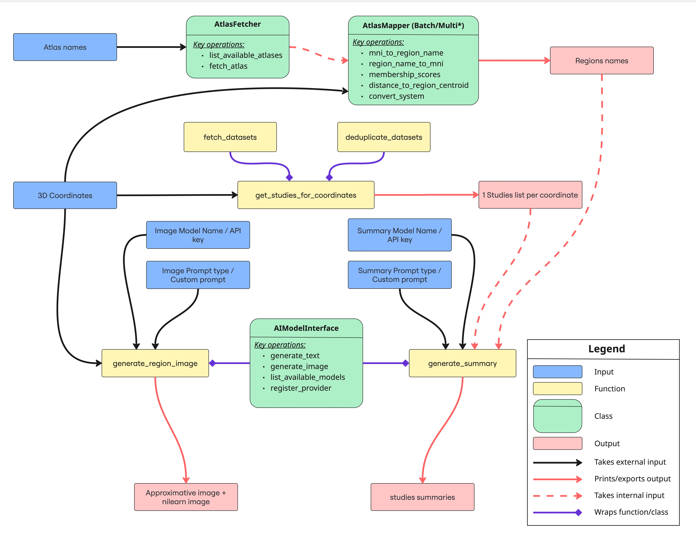
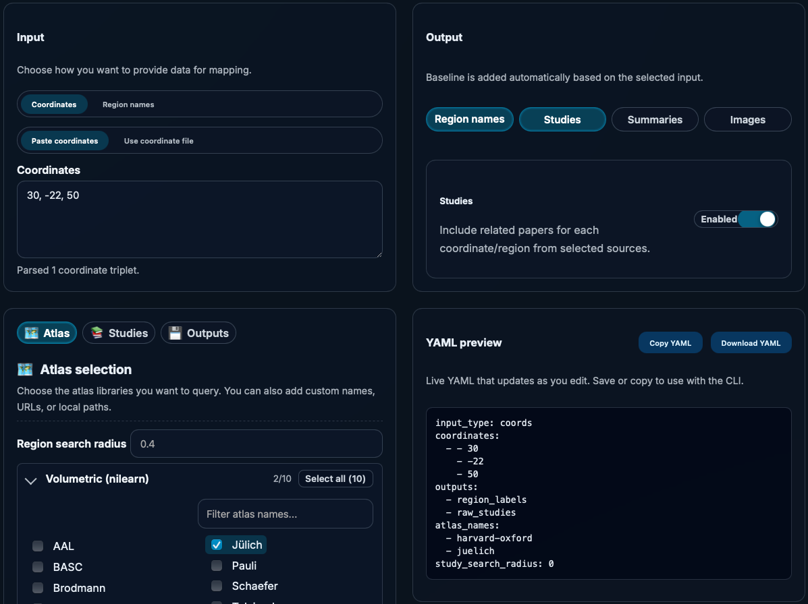
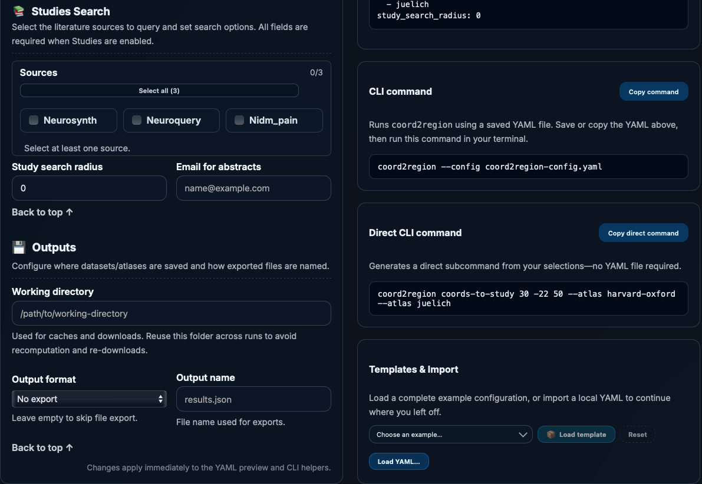
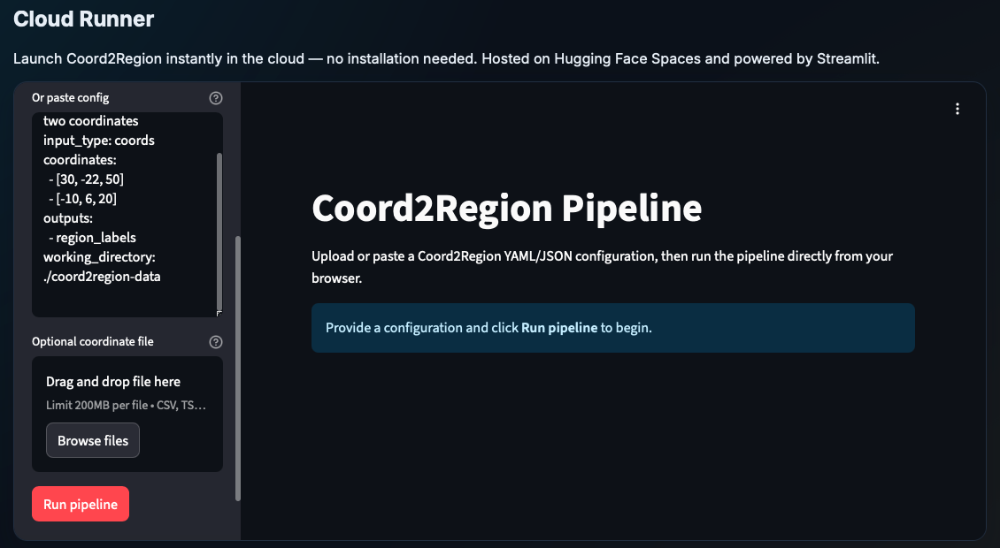

Coord2Region
============

.. list-table::
   :widths: 32 68
   :class: landing-hero

   * - **Start quickly**

         - **Version:** |release|
         - :doc:`Install Coord2Region <install>`
         - :doc:`Documentation overview <documentation_overview>`
         - :doc:`Release notes & story <README>`
         - :doc:`API reference <api_reference>`
         - :doc:`Get help & development <support_development>`

       **Dive deeper**

         - :doc:`Tutorials <tutorials>`
         - :doc:`Examples gallery <auto_examples/index>`
         - :doc:`Pipeline tour <pipeline>`
         - :doc:`Atlas guide <atlases>`
         - :doc:`Providers & integrations <providers>`

       **Community**

         - :ref:`How to cite <cite-coord2region>`
         - :ref:`Contribute <contribute>`
         - :ref:`Contributors <contributors>`
         - :doc:`Code of Conduct <CODE_OF_CONDUCT>`

     - .. figure:: ../static/images/logo.png
           :width: 240
           :alt: Coord2Region logo
           :align: center

       *Coord2Region* turns MNI coordinates into atlas-backed context, links studies, and optionally ships AI-ready summaries. One workflow spans the CLI, Python API, and hosted builder/runner so reproducible YAML/JSON/CSV artefacts follow you from laptops to the cloud.

Why Coord2Region
----------------

- Mix NiMARE, Nilearn, and MNE primitives without jumping between notebooks, CLIs, or hosted dashboards.
- Pull atlas labels, related studies, and summaries for a single coordinate or batch datasets in seconds.
- Export structured artefacts that downstream notebooks, dashboards, and collaborators can trust.

Pick your workflow
------------------

1. **CLI recipes** (:doc:`pipeline`) – define coordinates plus providers, run ``coord2region`` commands, and capture artefacts inside ``coord2region-output/``.
2. **Python API** (:doc:`README`) – embed atlas mapping, provider lookups, or AI summarisation in your own packages or notebooks.
3. **Builder web app** (:doc:`providers`) – describe inputs via forms that mirror the CLI schema, preview YAML/CLI, and export ready-to-run configs.
4. **Hosted runner** (:doc:`support_development`) – upload finished configs, stream logs, and download the resulting archives without managing compute.

Documentation map
-----------------

**Install & configure**
   - :doc:`install` – virtual environments, package install, verification.
   - :doc:`providers` – API keys, AI providers, hosted integrations.
   - :doc:`README` – release overview with screenshots and features.

**Learn by doing**
   - :doc:`documentation_overview` – section navigator inspired by MNE’s docs.
   - :doc:`tutorials` – notebook-style walkthroughs for complete pipelines.
   - :doc:`auto_examples/index` – short executable recipes for specific tasks.
   - :doc:`pipeline` – what happens between input coordinates and final artefacts.

**Atlases & data**
   - :doc:`atlases` – shipped atlases, download locations, and custom data.
   - :doc:`providers` – configure study sources, AI models, and images.

**Reference & community**
   - :doc:`api_reference` – generated API docs (requires ``sphinx-autoapi``).
   - :doc:`support_development` – help channels, citation text, contribution paths.
   - :doc:`developer_guide` – dev install, testing, release process.
   - :doc:`roadmap` – current priorities and future-facing milestones.

Coord2Region workflow
---------------------

   High-level workflow from inputs to outputs.

Web interface previews
----------------------

|ui1| |ui2| |ui3|

Community & support
-------------------

- Stay aligned with :doc:`support_development` for issue templates, conduct, and help links.
- Cite Coord2Region via :download:`CITATION.cff <../../CITATION.cff>` and showcase your work on the :ref:`contributors` list.
- Plan contributions through :doc:`developer_guide` and :doc:`roadmap`.

.. toctree::
   :maxdepth: 1
   :caption: Install & Configure

   install
   providers
   README

.. toctree::
   :maxdepth: 1
   :caption: Guides & Workflows

   documentation_overview
   tutorials
   pipeline
   atlases

.. toctree::
   :maxdepth: 1
   :caption: Examples & Reference

   auto_examples/index
   api_reference

.. toctree::
   :maxdepth: 1
   :caption: Community & Planning

   support_development
   developer_guide
   roadmap
